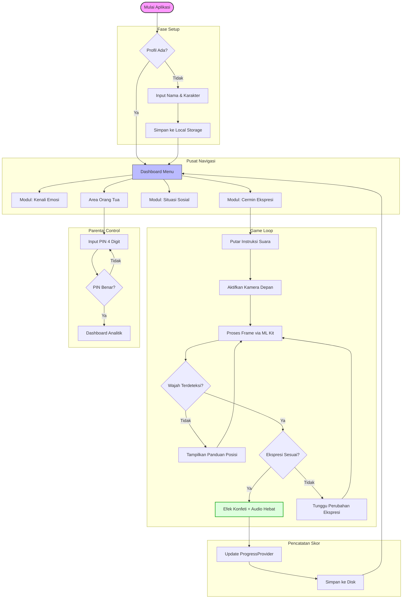
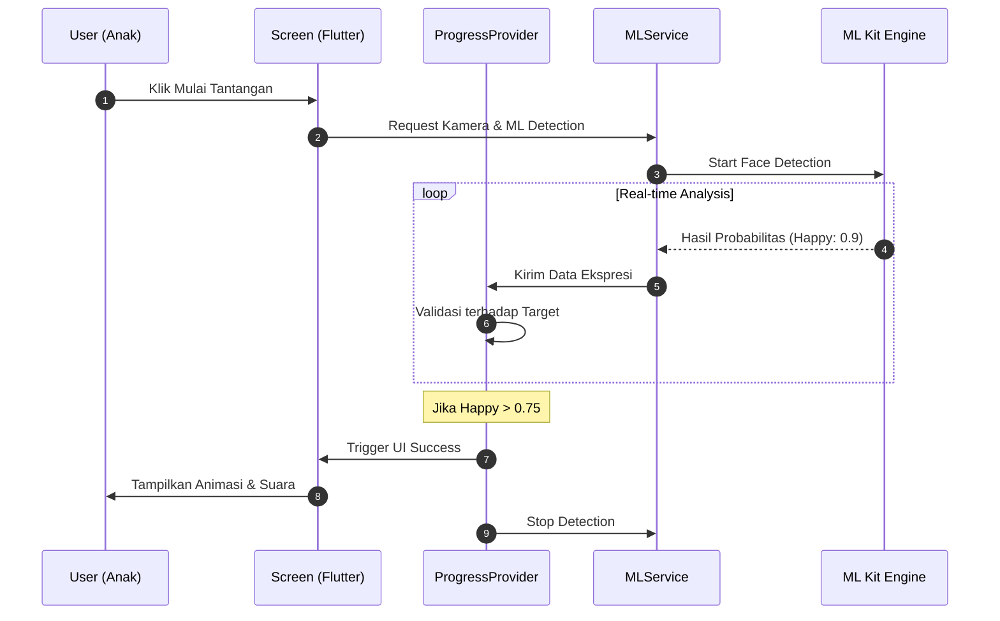

# Dokumentasi Lengkap Proyek: Moodmates

## 1. Pendahuluan
**Moodmates** adalah platform edukasi interaktif berbasis mobile yang dirancang khusus untuk anak usia dini (4-6 tahun). Aplikasi ini bertujuan membangun literasi emosi dan kecerdasan sosial melalui metode bermain berbasis *Social Emotional Learning* (SEL).

---

## 2. Struktur Arsitektur
Proyek ini mengadopsi pola **Layered Architecture**:
*   **View Layer (`screens/`):** UI reaktif berbasis Flutter.
*   **Business Logic Layer (`providers/`):** State management (Progress, Auth, Audio).
*   **Service Layer (`services/`):** Wrapper API (ML Kit, Camera, Storage).
*   **Data Layer (`models/`):** Struktur data type-safe.

---

## 3. Alur Sistem (Flowchart)

Berikut adalah diagram alur mendalam yang mencakup logika permainan dan validasi input:

---

## 4. Alur Kerja Teknis (Sequence Diagram)

Diagram ini menjelaskan interaksi antar komponen saat proses deteksi ekspresi:

---

## 5. Detail Teknis Komponen
*   **MLService:** Menggunakan `google_mlkit_face_detection` untuk mendapatkan `smilingProbability` dan `eyeOpenProbability`.
*   **AudioService:** Mengatur antrean audio agar instruksi tidak bertabrakan dengan efek suara pujian.
*   **StorageService:** Menggunakan `shared_preferences` untuk persistensi data ringan secara offline-first.

---
*Dokumentasi Moodmates v1.1.0*
